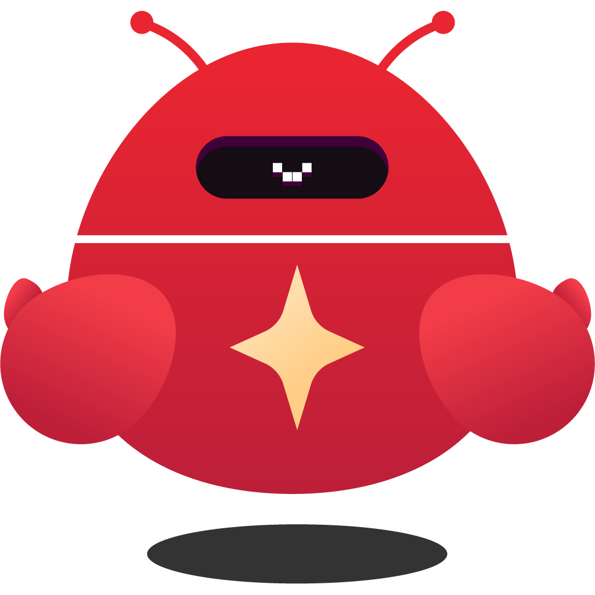

<p align="center">
  
</p>

<h1 align="center">YouClaw</h1>

<p align="center">
  <a href="./README.md">English</a> | <strong>简体中文</strong> | <a href="./README.ja.md">日本語</a>
</p>

<p align="center">
  <strong>基于多供应商 coding agent runtime 的桌面 AI Assistant</strong>
</p>

<p align="center">
  <a href="https://github.com/CodePhiliaX/youClaw/releases"></a>
  <a href="https://github.com/CodePhiliaX/youClaw/blob/main/LICENSE"></a>
  <a href="https://github.com/CodePhiliaX/youClaw/stargazers"></a>
  <a href="https://github.com/CodePhiliaX/youClaw"></a>
</p>

<p align="center">
  <strong>如果 YouClaw 对你有帮助，欢迎点一个 Star。</strong><br />
  每一个 Star 都会帮助更多人发现 YouClaw，也会直接支持项目后续迭代。
</p>

<p align="center">
  <a href="https://github.com/CodePhiliaX/youClaw/stargazers">
    
  </a>
</p>

<p align="center">
  <sub>一个小小的点击，会让项目更容易持续更新。</sub>
</p>

---

## 下载与安装

### macOS

从 [Releases](https://github.com/CodePhiliaX/youClaw/releases) 页面下载 `.dmg` 文件，打开后将 **YouClaw** 拖入 Applications。

> 同时支持 Apple Silicon（M1/M2/M3/M4）和 Intel。

### Windows

从 [Releases](https://github.com/CodePhiliaX/youClaw/releases) 下载 `.exe` 安装程序并运行。

### Linux

🚧 即将支持，敬请期待。

---

## 功能特性

- **多 Agent 管理**：通过 YAML 创建和配置多个 AI Agent，每个 Agent 都可以拥有自己的个性、记忆和技能
- **多渠道接入**：可连接 Telegram、钉钉、飞书（Lark）、QQ 和企业微信
- **浏览器自动化**：内置基于 Playwright 的 agent-browser skill，可用于网页操作、抓取和测试
- **定时任务**：支持 Cron / interval / one-shot 任务，并带有自动重试和卡死检测
- **持久化记忆**：提供按 Agent 隔离的记忆系统和会话日志
- **技能系统**：兼容 OpenClaw `SKILL.md` 格式，支持三级优先级加载、热重载和技能市场
- **认证能力**：内置认证系统，适合云端部署
- **Web UI**：基于 React + shadcn/ui，支持 SSE 流式响应与中英文界面
- **轻量桌面应用**：Tauri 2 安装包约 27 MB（对比 Electron 约 338 MB），支持原生系统托盘

## 技术栈

| 层级 | 选型 |
|------|------|
| 运行时与包管理 | [Bun](https://bun.sh/) |
| 桌面壳层 | [Tauri 2](https://tauri.app/)（Rust） |
| 后端 | Hono + bun:sqlite + Pino |
| Agent | `@mariozechner/pi-coding-agent` + `@mariozechner/pi-ai` |
| 前端 | Vite + React + shadcn/ui + Tailwind CSS |
| 渠道 | grammY（Telegram）· `dingtalk-stream`（钉钉）· `@larksuiteoapi/node-sdk`（飞书）· QQ · 企业微信 |
| 定时任务 | croner |
| E2E 测试 | Playwright |

## 架构

```
┌──────────────────────────────────────────────────────┐
│                Tauri 2 (Rust Shell)                   │
│   ┌──────────────┐    ┌────────────────────────────┐ │
│   │   WebView     │    │   Bun Sidecar              │ │
│   │  Vite+React   │◄──►  Hono API Server           │ │
│   │  shadcn/ui    │ HTTP│  多供应商 Agent Runtime   │ │
│   │               │ SSE │  bun:sqlite               │ │
│   └──────────────┘    └────────────────────────────┘ │
└──────────────────────────────────────────────────────┘
         │                        │
    Tauri Store              EventBus
   (settings)          ┌────────┴────────────┐
                        │                     │
                   Web / API         Multi-Channel
                              ┌───────┼───────┐
                           Telegram DingTalk Feishu
                              QQ    WeCom
                                     │
                              Browser Automation
                               (Playwright)
```

- **桌面模式**：Tauri 会启动一个 Bun sidecar 进程，WebView 负责加载前端
- **Web 模式**：Vite 前端与 Bun 后端可以独立部署
- **三层设计**：入口层（Telegram/DingTalk/Feishu/QQ/WeCom/Web/API）→ 核心层（Agent/Scheduler/Memory/Skills）→ 存储层（SQLite/文件系统）

<p align="center">
  <a href="https://github.com/CodePhiliaX/youClaw/stargazers">
    
  </a>
</p>

<p align="center">
  <strong>开始之前：如果你希望 YouClaw 持续更新，欢迎先点个 Star。</strong><br />
  这是支持项目继续演进最直接的一种方式。
</p>

## 快速开始（开发）

### 前置要求

- [Bun](https://bun.sh/) >= 1.1
- [Rust](https://rustup.rs/)（用于构建 Tauri 桌面应用）
- 你所选模型供应商的 API key

### 安装与初始化

```bash
git clone https://github.com/CodePhiliaX/youClaw.git
cd youClaw

# 安装依赖
bun install
cd web && bun install && cd ..

# 配置环境变量
cp .env.example .env
# 编辑 .env 并设置 MODEL_API_KEY
```

### Web 模式

```bash
# 终端 1：后端
bun dev

# 终端 2：前端
bun dev:web
```

打开 http://localhost:5173 · API 地址为 http://localhost:62601

### 桌面模式（Tauri）

```bash
bun dev:tauri
```

### 构建桌面应用

```bash
bun build:tauri
```

输出目录：`src-tauri/target/release/bundle/`（DMG / MSI / AppImage）

## 常用命令

```bash
bun dev              # 启动后端开发服务器（热重载）
bun dev:web          # 启动前端开发服务器
bun dev:tauri        # 启动 Tauri 开发模式（前端 + 后端 + WebView）
bun start            # 启动生产模式后端
bun typecheck        # TypeScript 类型检查
bun test             # 运行测试
bun build:sidecar    # 编译 Bun sidecar 二进制
bun build:tauri      # 构建 Tauri 桌面应用
bun build:tauri:fast # 不打包构建（更快的开发构建）
bun test:e2e         # 运行 E2E 测试（Playwright）
bun test:e2e:ui      # 以 UI 模式运行 E2E 测试
```

## 环境变量

| 变量 | 必填 | 默认值 | 说明 |
|------|------|--------|------|
| `MODEL_PROVIDER` | 否 | `builtin` | 默认模型供应商或运行模式 |
| `MODEL_ID` | 否 | `minimax/MiniMax-M2.7-highspeed` | 默认模型引用 |
| `MODEL_API_KEY` | 是 | — | 模型 API key |
| `MODEL_BASE_URL` | 否 | — | 自定义模型 API Base URL |
| `PORT` | 否 | `62601` | 后端服务端口 |
| `DATA_DIR` | 否 | `./data` | 数据存储目录 |
| `LOG_LEVEL` | 否 | `info` | 日志级别 |
| `TELEGRAM_BOT_TOKEN` | 否 | — | 启用 Telegram 渠道 |
| `DINGTALK_CLIENT_ID` | 否 | — | 钉钉应用 Client ID |
| `DINGTALK_SECRET` | 否 | — | 钉钉应用 Secret |
| `FEISHU_APP_ID` | 否 | — | 飞书（Lark）应用 App ID |
| `FEISHU_APP_SECRET` | 否 | — | 飞书（Lark）应用 App Secret |
| `QQ_BOT_APP_ID` | 否 | — | QQ Bot App ID |
| `QQ_BOT_SECRET` | 否 | — | QQ Bot Secret |
| `WECOM_CORP_ID` | 否 | — | 企业微信 Corp ID |
| `WECOM_CORP_SECRET` | 否 | — | 企业微信 Corp Secret |
| `WECOM_AGENT_ID` | 否 | — | 企业微信 Agent ID |
| `WECOM_TOKEN` | 否 | — | 企业微信回调 Token |
| `WECOM_ENCODING_AES_KEY` | 否 | — | 企业微信回调 AES Key |
| `YOUCLAW_WEBSITE_URL` | 否 | — | 云服务网站地址 |
| `YOUCLAW_API_URL` | 否 | — | 云服务 API 地址 |
| `MINIMAX_API_KEY` | 否 | — | MiniMax Web Search API key |
| `MINIMAX_API_HOST` | 否 | — | MiniMax API Host |

## 项目结构

```
src/
├── agent/          # AgentManager、AgentRuntime、AgentQueue、PromptBuilder
├── channel/        # 多渠道支持
│   ├── router.ts   # MessageRouter
│   ├── telegram.ts # Telegram（grammY）
│   ├── dingtalk.ts # 钉钉（dingtalk-stream）
│   ├── feishu.ts   # 飞书 / Lark（@larksuiteoapi/node-sdk）
│   ├── qq.ts       # QQ
│   └── wecom.ts    # 企业微信
├── config/         # 环境变量校验、路径常量
├── db/             # bun:sqlite 初始化与 CRUD
├── events/         # EventBus（stream/tool_use/complete/error）
├── ipc/            # Agent 与主进程间的文件轮询 IPC
├── logger/         # Pino 日志
├── memory/         # 根目录 MEMORY.md 与各 Agent 日志/归档的内存辅助模块
├── routes/         # Hono API 路由（/api/*）
├── scheduler/      # Cron/interval/once 任务调度
├── skills/         # 技能加载器、监听器、frontmatter 解析
src-tauri/
├── src/            # Rust 主进程（sidecar、window、tray、updater）
agents/             # Agent 工作区（agent.yaml + bootstrap 文档 + MEMORY.md + skills/）
skills/             # 项目级技能（SKILL.md 格式）
e2e/                # E2E 测试（Playwright）
web/src/
├── pages/          # Chat、Agents、Skills、Memory、Tasks、Channels、BrowserProfiles、Logs、System、Login
├── components/     # Layout + shadcn/ui
├── api/            # HTTP client + transport
├── i18n/           # i18n（中文 / English）
```

## 贡献指南

1. Fork 仓库并从 `main` 创建分支
2. 完成修改后，确保 `bun typecheck` 和 `bun test` 通过
3. 提交 Pull Request

<p align="center">
  <a href="https://star-history.com/#CodePhiliaX/youClaw&Date">
    <picture>
      <source media="(prefers-color-scheme: dark)" srcset="https://api.star-history.com/svg?repos=CodePhiliaX/youClaw&type=Date&theme=dark" />
      <source media="(prefers-color-scheme: light)" srcset="https://api.star-history.com/svg?repos=CodePhiliaX/youClaw&type=Date" />
      
    </picture>
  </a>
</p>

## License

[MIT](LICENSE) © CHATDATA
